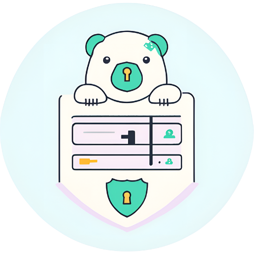

# 🐨 KeyKoala

<div align="center">



A secure, lightweight, and user-friendly password manager built with Python.

[](https://opensource.org/licenses/MIT)
[](https://www.python.org/downloads/)
[](https://github.com/psf/black)

</div>

## 🚀 Features

- 🔐 Master password protection
- 🔒 Strong encryption using Fernet
- 📋 Quick copy passwords to clipboard
- 💾 Secure local storage
- 🖥️ Clean, intuitive GUI
- 🏃 Lightweight and fast
- 📱 Cross-platform support

## 🛠️ Installation

1. Clone the repository
```bash
git clone https://github.com/yourusername/keykoala.git
cd keykoala
```

2. Create and activate virtual environment
```bash
python -m venv venv
source venv/bin/activate  # On Windows: venv\Scripts\activate
```

3. Install dependencies
```bash
pip install -r requirements.txt
```

4. Install tkinter (if not already installed)

**Ubuntu/Debian:**
```bash
sudo apt-get install python3-tk
```

**Fedora:**
```bash
sudo dnf install python3-tkinter
```

**macOS:**
```bash
brew install python-tk
```

## 🏃‍♂️ Running KeyKoala

From the project root directory:
```bash
PYTHONPATH=$PYTHONPATH:$(pwd) python src/main.py
```

## 🔒 Security Features

- Strong encryption using Fernet (symmetric encryption)
- Master password never stored, only used for key derivation
- Passwords only decrypted when copying to clipboard
- All data stored locally on your machine

## 🤝 Contributing

Contributions are welcome! Please feel free to submit a Pull Request. For major changes, please open an issue first to discuss what you would like to change.

1. Fork the repository
2. Create your feature branch (`git checkout -b feature/AmazingFeature`)
3. Commit your changes (`git commit -m 'Add some AmazingFeature'`)
4. Push to the branch (`git push origin feature/AmazingFeature`)
5. Open a Pull Request

## 📝 Development Tasks

- [ ] Password generation functionality
- [ ] Password strength checker
- [ ] Import/export functionality
- [ ] Dark mode support
- [ ] Password categories/folders
- [ ] Auto-logout feature
- [ ] Two-factor authentication
- [ ] Browser extension

## 🐛 Known Issues

- None reported yet

## 📦 Dependencies

- Python 3.7+
- tkinter
- cryptography
- pyperclip

## ⚠️ Disclaimer

KeyKoala is a demonstration project and should not be used as your primary password manager without thorough security auditing. For sensitive information, please use established password managers like Bitwarden, LastPass, or 1Password.

## 📄 License

This project is licensed under the MIT License - see the [LICENSE](LICENSE) file for details.

## 🙏 Acknowledgments

- Inspired by modern password managers
- Built with Python's cryptography library
- Uses tkinter for the GUI

## 📧 Contact

- Project Maintainer: [Blake Ridgway](mailto:blake@blakeridgway.com)
- Project Link: [https://github.com/blakeridgway/keykoala](https://github.com/blakeridgway/keykoala)

## 🌟 Support

If you find this project helpful, please give it a star! ⭐

---

<div align="center">
Made with ❤️ by Blake Ridgway
</div>
```